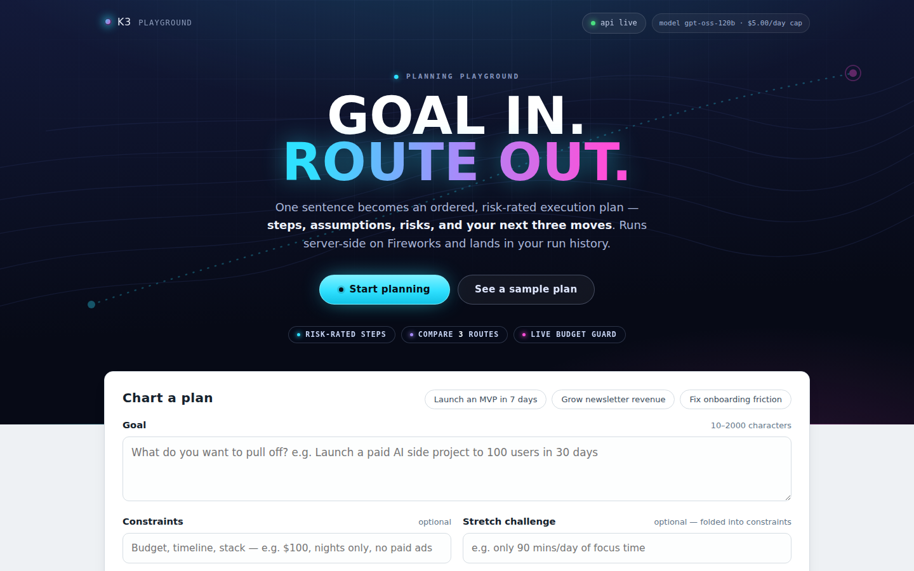
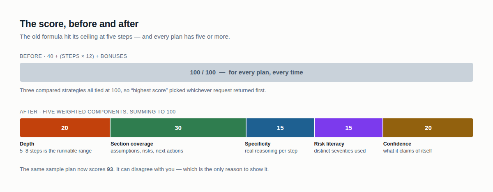
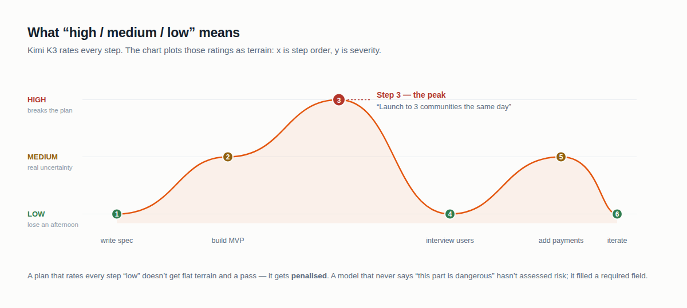
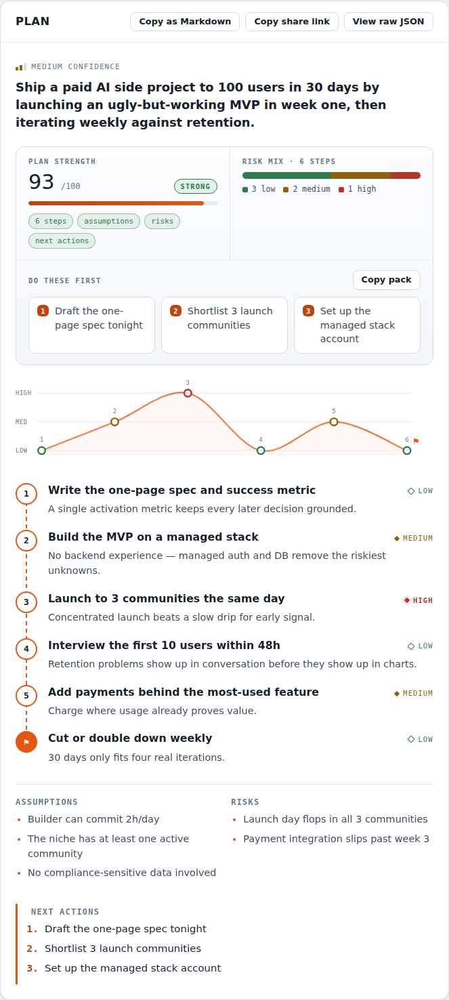
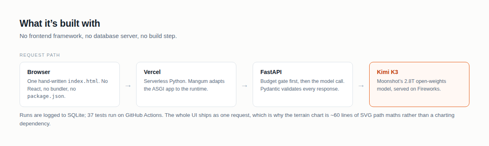

# K3 Planner

[](https://github.com/abhid1234/kimi-k3/actions/workflows/tests.yml)
[](LICENSE)

**A playground for [Kimi K3](https://fireworks.ai/models/fireworks/kimi-k3), running on
[Fireworks](https://fireworks.ai).** I wanted to actually use K3 rather than benchmark it,
and ended up building this. Give it a goal; it returns an ordered plan with a risk rating
on every step, the assumptions it made, and your first three moves.

**→ [kimi-k3-ashy.vercel.app](https://kimi-k3-ashy.vercel.app)** · no signup, free,
and a demo mode that never touches the API.



---

## The bug worth knowing about

I built a "plan strength" score, 0–100, with a meter under it. The formula was:

```
40 + (steps × 12) + 10 if assumptions + 10 if risks + 10 if next actions
```

Five steps gets you to 100. Every plan has five or more steps. So **every plan scored
100/100** — and compare mode, which ranks three strategies by that same score, produced
three-way ties where "highest score" landed on whichever request returned first.

A metric that always returns the same number isn't a weak metric. It's decoration.



It now spreads across five weighted components summing to exactly 100. The one worth
defending is **risk literacy**: if a model rates all six steps "low", it didn't assess
risk — it filled a required field. Uniform ratings get penalised.

The same sample plan now scores **93**, not 100. It can disagree with you, which is the
only reason to show it.

[Full write-up →](https://kimi-k3-ashy.vercel.app) *(blog link goes here once published)*

## What "high / medium / low" means



Kimi K3 rates every step for risk — how likely it is to go wrong, and how much it hurts
if it does:

- **Low** — routine. If it fails you lose an afternoon.
- **Medium** — real uncertainty. Depends on something you don't fully control.
- **High** — where the plan actually breaks. The step everything downstream waits on.

The chart plots those as terrain: **x is step order, y is severity**. The line climbs
where the plan gets dangerous, so the peaks are the steps most likely to sink you.

## What it does



- **Action Plan Pack** — strength score, risk mix across steps, and the first three
  moves as cards. One click copies the lot as a briefing.
- **Risk terrain** — hover a peak, the matching step highlights.
- **Compare three strategies** — same goal through *current constraints*, *speed-first*
  and *risk-minimized*, as three visibly different risk profiles.
- **Hard budget cap** — `$5/day` by default. On the cap, `/api/plan` returns a 429 with
  a plain message rather than a stack trace.
- **Demo mode** — `?demo=plan` and `?demo=compare` render bundled sample data through
  the real render path with zero API calls.
- **Share links** — *Copy share link* encodes the composer state; `?auto=1` runs it.

## Built with



| Layer | Tool |
|---|---|
| Model | **Kimi K3** — Moonshot's 2.8T open-weights model |
| Inference | **Fireworks AI** serverless |
| Backend | FastAPI, Pydantic for schema validation, httpx |
| Serverless glue | Mangum (ASGI → Vercel Python runtime) |
| Hosting | Vercel |
| Frontend | one hand-written `static/index.html` — no framework, no build step |
| Storage | SQLite run log |
| Tests | 37, on GitHub Actions |

Two choices worth defending. The single HTML file means the risk chart is ~60 lines of
SVG path maths rather than a charting dependency, and the whole UI ships as one request.
And Pydantic is load-bearing: model output is sanitised and validated before it reaches
the UI — off-enum risk values normalise to low/medium/high, malformed JSON hits a
fallback parser. That's what makes it safe to render straight into a chart.

## Run locally

```bash
python3 -m venv .venv && source .venv/bin/activate
pip install -r requirements.txt
cp .env.example .env          # then set FIREWORKS_API_KEY
uvicorn app.main:app --reload
```

Open `http://127.0.0.1:8000`. Click **See a sample plan** to exercise the UI without
spending anything.

```bash
pytest tests/ -q                                    # 37 tests
BASE_URL=http://127.0.0.1:8000 bash scripts/smoke.sh
```

## Endpoints

| | |
|---|---|
| `GET /` | serves the UI |
| `GET /api/health` | `{"status": "ok"}` |
| `GET /api/config` | model, daily budget, per-run estimate, cap state |
| `POST /api/plan` | goal / constraints / context / tone → plan |
| `GET /api/runs` | recent saved runs |

## Configuration

| Variable | Default |
|---|---|
| `FIREWORKS_API_KEY` | **required** |
| `FIREWORKS_MODEL` | `accounts/fireworks/models/kimi-k3` |
| `FIREWORKS_TEMPERATURE` | `0.2` |
| `FIREWORKS_MAX_TOKENS` | `1800` |
| `KIMI_DAILY_BUDGET_USD` | `5` |
| `KIMI_ESTIMATED_COST_USD` | `0.02` |
| `KIMI_DB_PATH` | `data/runs.db` (`/tmp/kimi-k3-runs.db` on Vercel) |

Runs are stored with: `goal`, `constraints`, `context`, `tone`, `status`, `model`,
`latency_ms`, `response_json`, `raw_output`, `error`.

## Deploy

**Vercel** — `vercel.json` routes everything to `api/index.py`, which wraps the FastAPI
app with Mangum. Set the variables above in Project Settings → Environment Variables,
then redeploy. Env var changes do not redeploy on their own.

**Docker**

```bash
docker build -t kimi-k3 .
docker run --rm -p 8000:8000 --env-file .env -v "$PWD/data:/app/data" kimi-k3
```

Verify a deploy with `BASE_URL=https://your-url bash scripts/smoke.sh`.

## Known behavior

- Missing `FIREWORKS_API_KEY` → `/api/plan` returns 502 with a clear error and records a
  failed run.
- Tone input is normalised (`confident`, `short`, `business`) to `clear` / `concise` /
  `executive`; risk and confidence values off-enum normalise to low/medium/high.
- Malformed model output is sanitised, then rejected with a validation error if it still
  doesn't fit the schema.
- **Run history is ephemeral on Vercel** — SQLite lives on `/tmp` and is wiped on cold
  start. Durable history needs a real database.
- The app's inline script does not execute when the page is embedded in an `iframe`.

## Screenshots

`docs/screenshots/` — hero (desktop and 390px), the Action Plan Pack, the risk chart
with its axis explained, compare mode, and the loading/empty/error states.

## License

MIT — see [LICENSE](LICENSE).
